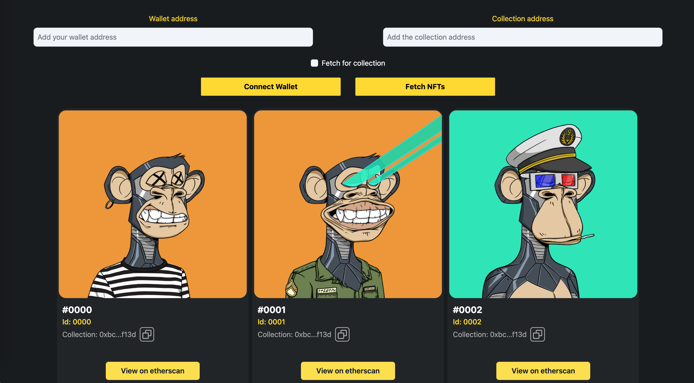

# NFT Gallery



This is a Next.js based NFT gallery that utilizes the Alchemy NFT API for displaying NFTs and Wagmi a collection of React Hooks that makes it easy to "Connect Wallet"

## Getting Started

1. Clone the repository: `git clone https://github.com/CoCo-27/NFT_Maketplace`
2. Install dependencies: `npm install` or `yarn install`
3. Create an account and get an API key from [Alchemy](https://alchemy.daostack.io/)
4. Create a `.env` file in the root of the project and add the following environment variables:

```bash
ALCHEMY_API_KEY=YourAlchemyApiKey
```

5. Start the development server: `npm run dev` or `yarn dev`
6. Open [http://localhost:3000](http://localhost:3000) to view the gallery in the browser.

## Deployment

This project is set up for deployment to Vercel. Simply connect your repository to Vercel and it will automatically build and deploy the project.

## Built With

- [Next.js](https://nextjs.org/) - A framework for building server-rendered React applications
- [Alchemy NFT API](https://alchemy.daostack.io/) - An API for interacting with NFTs on the Ethereum blockchain
- [Wagmi](https://wagmi.sh/) - A collection of React Hooks containing everything you need to working with Ethereum
